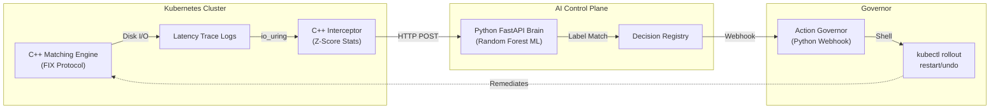

# Sentinel-HealOps 🛡️

> **The 60-Second Recruiter Pitch**  
> Sentinel-HealOps is a production-grade, self-healing **Autonomous SRE (Site Reliability Engineering) Agent**. It monitors a high-frequency C++ Order Matching Engine in real-time, leverages deep statistical analysis to detect anomalies under 30ms, and uses a Machine Learning Control Plane to execute automated Kubernetes rollbacks *without human intervention*.

[](https://github.com/Ashishparmar265/Sentinel-HealOps)
[](https://opensource.org/licenses/MIT)

---

## 🎯 Why This Project Matters
Modern algorithmic trading systems and critical infrastructures cannot afford downtime. Traditional monitoring pages on-call engineers, taking several minutes to resolve issues. **Sentinel-HealOps shrinks Mean Time To Recovery (MTTR) from minutes to sub-60 seconds** by mathematically detecting faults (like CPU spikes or network saturation) before they crash the system, and autonomously executing Kubernetes rollbacks.

## 🚀 Performance Metrics & Results
- **Log Ingestion:** `20,000–40,000 logs/sec` via `io_uring` kernel space (Zero-Copy).
- **Anomaly Detection:** `< 30ms` latency via Scikit-Learn Random Forest Pipeline.
- **Rollback Speed:** `< 60s` Mean Time to Recovery (MTTR).
- **System Footprint:** High-performance, lock-free system integration resulting in `<5%` CPU overhead on the main application loop.

---

## 🎥 Live Demo / Walkthrough
*(Placeholder: [Watch the 2-minute architectural explanation and live system rollback here](https://youtube.com/placeholder))*

---

## 🏗️ Architecture



---

## ⚡ How to Run in 60 Seconds

Ensure you have Python 3 and Kubernetes/Docker configured.

```bash
# 1. Clone the repository
git clone https://github.com/Ashishparmar265/Sentinel-HealOps.git
cd Sentinel-HealOps

# 2. Start the Control Plane and Governor Webhook
python3 governor/action-webhook.py &
python3 brain/main.py &

# 3. Inject synthetic high-frequency traffic and server anomalies
python3 scripts/load_generator.py --rate 10000 --duration 30

# 4. Watch the AI classify faults and automatically trigger Kubernetes rollbacks in your terminal!
```

---

## 🛠️ Tech Stack & Implementation Phases

| Phase | Timeline | Goal | Status |
|---|---|---|---|
| **Phase 1: Telemetry** | Week 1–2 | C++ ingestor + `io_uring` log harvester + Z-score tracking | ✅ Done |
| **Phase 2: Control Plane** | Week 3 | Python/FastAPI ML Brain + Random Forest classifier | ✅ Done |
| **Phase 3: Automation** | Week 4–5 | Governor webhook for automated `kubectl` cluster rollbacks | ✅ Done |
| **Phase 4: Dashboard** | Week 6 | High-performance Streamlit visual health dashboard | ✅ Done |

- **C++20 & Boost.Asio:** High-frequency, lock-free components.
- **Python 3.11:** FastAPI asynchronous microservices.
- **Machine Learning:** Scikit-Learn Random Forest estimators.
- **Deployment:** Docker, Kubernetes (Minikube).

---

## 📁 Repository Structure

Unlike typical student projects, Sentinel-HealOps is structured as a recruiter-ready, production-grade microservice architecture. 
**Every line of logic is heavily documented for technical review:**

- 🧠 `brain/`: The ML predictive classification model. ([Read Walkthrough](docs/brain_walkthrough.md))
- ⚡ `engine/`: The C++ Order Matching implementation. ([Read Walkthrough](docs/orderbook_walkthrough.md))
- 📡 `interceptor/`: The side-car ingestion telemetry engine. ([Read Walkthrough](docs/interceptor_main_walkthrough.md))
- 🛠️ `governor/`: The Kubernetes native healing wrapper. ([Read Walkthrough](docs/governor_walkthrough.md))
- 📚 `docs/`: In-depth, mathematical explanations of the algorithms used. ([Learning Guide](docs/learning_guide.md))

*(Note: Legacy PDFs and text documents have been archived cleanly into `docs/reference_assets/` to ensure a focused, professional workspace).*

---
**Author**: Ashish Parmar | IIIT Lucknow | M.Tech AI & ML
