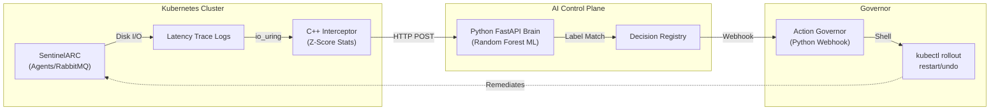

# Sentinel-HealOps 🛡️

> Sentinel-HealOps is a production-grade, self-healing **Autonomous SRE (Site Reliability Engineering) Agent**. It monitors the **SentinelARC multi-agent framework** in real-time, leverages deep statistical analysis to detect anomalies under 30ms, and uses a Machine Learning Control Plane to execute automated Kubernetes rollbacks *without human intervention*.

[](https://github.com/Ashishparmar265/Sentinel-HealOps)
[](https://opensource.org/licenses/MIT)

---

## 🎯 Why This Project Matters
Modern multi-agent systems and asynchronous AI workflows cannot afford downtime. Traditional monitoring pages on-call engineers, taking several minutes to resolve issues. **Sentinel-HealOps shrinks Mean Time To Recovery (MTTR) from minutes to sub-60 seconds** by mathematically detecting faults (like CRIU resume stalls or RabbitMQ backpressure) before they crash the system, and autonomously executing Kubernetes rollbacks.

## 🚀 Performance Metrics & Results
- **Log Ingestion:** `20,000–40,000 logs/sec` via `io_uring` kernel space (Zero-Copy).
- **Anomaly Detection:** `< 30ms` latency via Scikit-Learn Random Forest Pipeline.
- **Rollback Speed:** `< 60s` Mean Time to Recovery (MTTR).
- **System Footprint:** High-performance, lock-free system integration resulting in `<5%` CPU overhead on the main application loop.

---

## 🎥 Live Demo / Walkthrough
*(Placeholder: [Watch the 2-minute architectural explanation and live system rollback here]())*

---

## 🏗️ Architecture


```mermaid
flowchart LR
    subgraph K8s_Cluster["Kubernetes Cluster"]
        ME["SentinelARC\n(Agents/RabbitMQ)"] -- Disk I/O --> CSV["Latency Trace Logs"]
        CSV -- io_uring --> INC["C++ Interceptor\n(Z-Score Stats)"]
    end
    
    subgraph Control_Plane["AI Control Plane"]
        INC -- HTTP POST --> BR["Python FastAPI Brain\n(Random Forest ML)"]
        BR -- Label Match --> REG["Decision Registry"]
    end
    
    subgraph Governor_Layer["Governor"]
        REG -- Webhook --> GOV["Action Governor\n(Python Webhook)"]
        GOV -- Shell --> KUB["kubectl rollout\nrestart/undo"]
    end

    KUB -. Remediates .-> ME
```

---

## ⚡ How to Run in 60 Seconds

Ensure you have Python 3 and Kubernetes/Docker configured.

```bash
# 1. Clone the repository
git clone https://github.com/Ashishparmar265/Sentinel-HealOps.git
cd Sentinel-HealOps

# 2. Start the Control Plane and Governor Webhook
python3 governor/action-webhook.py &
python3 brain/main.py &

# 3. Inject synthetic SentinelARC traffic and server anomalies
python3 scripts/sentinelarc_sentinelarc_load_generator.py --rate 200 --duration 30

# 4. Watch the AI classify faults and automatically trigger Kubernetes rollbacks in your terminal!
```

---

## 🛠️ Tech Stack & Implementation Phases


- **C++20 & Boost.Asio:** High-frequency, lock-free components.
- **Python 3.11:** FastAPI asynchronous microservices.
- **Machine Learning:** Scikit-Learn Random Forest estimators.
- **Deployment:** Docker, Kubernetes (Minikube).

---

## 📁 Repository Structure

- 🧠 `brain/`: The ML predictive classification model. ([Read Walkthrough](docs/brain_walkthrough.md))
- 📡 `interceptor/`: The side-car ingestion telemetry engine. ([Read Walkthrough](docs/interceptor_main_walkthrough.md))
- 🛠️ `governor/`: The Kubernetes native healing wrapper. ([Read Walkthrough](docs/governor_walkthrough.md))
- 📚 `docs/`: In-depth, mathematical explanations of the algorithms used. ([Learning Guide](docs/learning_guide.md))


---
**Author**: Ashish Parmar | IIIT Lucknow | M.Tech AI & ML
